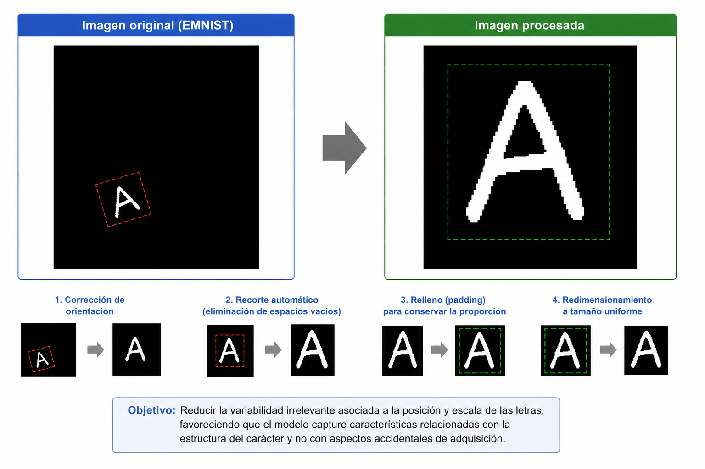
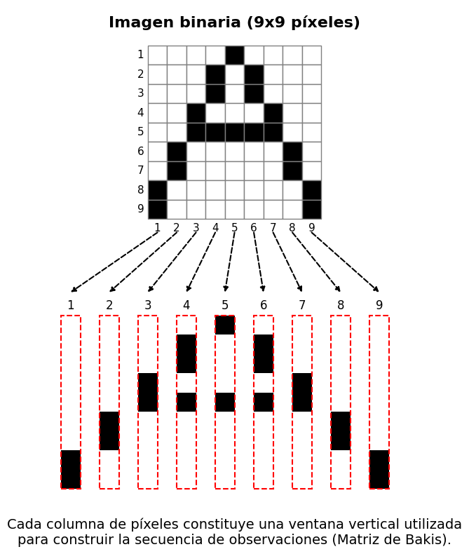
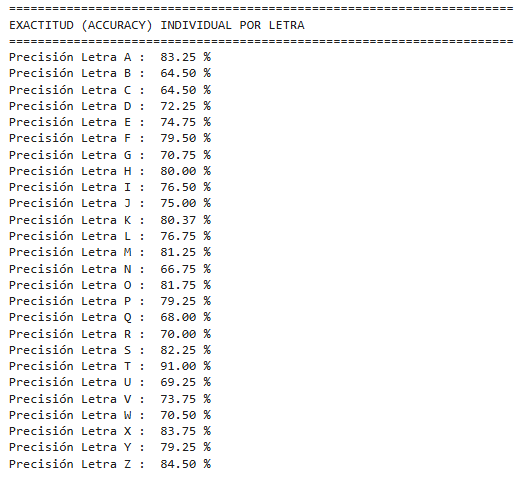
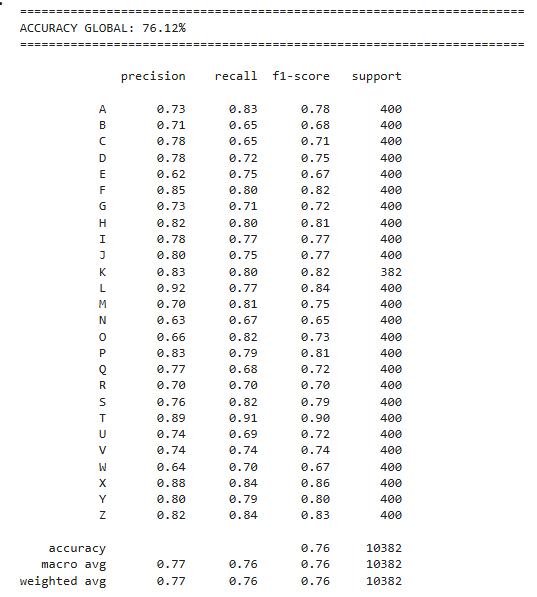
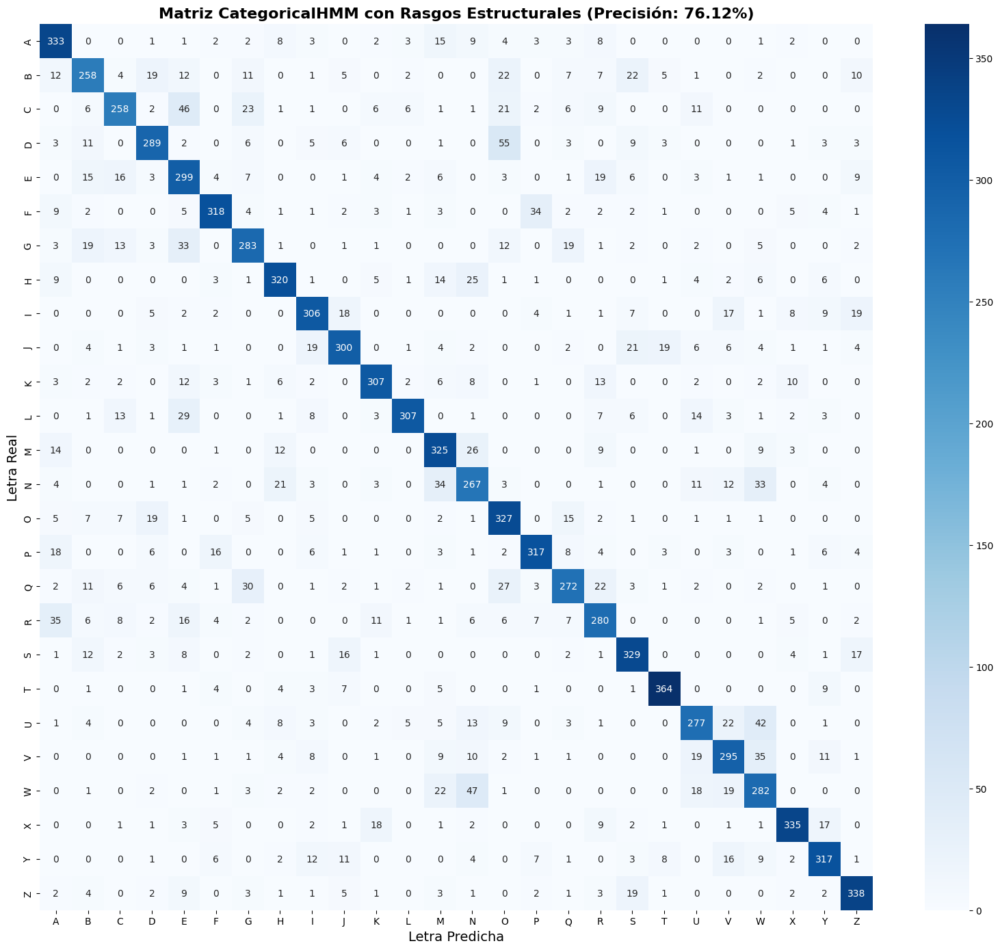

# Reconocimiento de Caracteres Caso de estudio

En este capítulo se describe la metodología implementada para el reconocimiento automático de letras mayúsculas manuscritas del alfabeto latino mediante Modelos Ocultos de Markov (HMM). A diferencia del capítulo anterior, donde se presentaron los fundamentos teóricos del modelo, en esta sección se detallan las decisiones experimentales adoptadas, así como las etapas seguidas para la construcción, entrenamiento y evaluación del sistema de reconocimiento.

Con el propósito de garantizar la reproducibilidad del experimento, se presenta el código utilizado durante el desarrollo del proyecto. Debido al elevado tiempo de ejecución requerido para el entrenamiento de los modelos, los bloques de código se muestran únicamente con fines documentales y no son ejecutados automáticamente dentro del presente documento.

## Configuración del entorno experimental

El primer paso consistió en importar las bibliotecas necesarias para el procesamiento de imágenes, manipulación de datos, entrenamiento de los modelos HMM y evaluación de resultados. Asimismo, se estableció una conexión con un sistema de almacenamiento externo para conservar los modelos entrenados y evitar repetir el proceso de ajuste en ejecuciones posteriores.

```         
from google.colab import drive 
drive.mount('/content/drive') 
import cv2 
import numpy as np 
import torchvision.datasets as datasets 
import torchvision.transforms as transforms 
import matplotlib.pyplot as plt 
import seaborn as sns 
import random 
import os 
import pickle 
from tqdm import tqdm  
try:     
    from hmmlearn import hmm 
except ImportError:     
    import subprocess     
    import sys     
    subprocess.check_call([sys.executable, "-m", "pip", "install", "hmmlearn"])     
    from hmmlearn import hmm  
from sklearn.metrics import accuracy_score, confusion_matrix, classification_report 
import warnings 
```

La utilización de estas bibliotecas responde a necesidades específicas del sistema. $\texttt{OpenCV}$ permitió realizar operaciones de preprocesamiento sobre las imágenes; $\texttt{torchvision}$ proporcionó acceso al conjunto de datos **EMNIST** [@cohen2017emnist]; $\texttt{hmmlearn}$ hizo posible la implementación de los modelos ocultos de Markov; mientras que $\texttt{scikit-learn}$ facilitó el cálculo de las métricas de evaluación.

Con el fin de asegurar la reproducibilidad de los resultados, se fijaron semillas aleatorias y se deshabilitaron advertencias no críticas del entorno de ejecución.

```         
np.random.seed(42) 
random.seed(42) 
warnings.filterwarnings("ignore") 
```

El establecimiento de semillas garantiza que los procesos dependientes del azar produzcan resultados consistentes entre diferentes ejecuciones, permitiendo replicar los experimentos bajo las mismas condiciones iniciales.

## Definición de parámetros del experimento

A continuación, se definieron los parámetros principales utilizados durante el entrenamiento y evaluación del sistema.

```         
N_ESTADOS = 12
TRAIN_POR_CLASE = 1500
TEST_POR_CLASE = 400

IMG_SIZE = 40
UMBRAL = 0.30

ARCHIVO_MODELOS_CAT = "/content/drive/MyDrive/modelos_categorical_v_avanzada_hmm.pkl"

TARGETS_MAYUSCULAS = list(range(10,36))
MAPEO_LETTERS = {i: chr(ord('A') + (i - 10)) for i in range(10,36)}
LETRAS_OBJETIVO = [chr(ord('A') + i) for i in range(26)]
```

Se optó por utilizar 12 estados ocultos para representar la evolución secuencial de cada letra manuscrita. Este número proporciona un equilibrio entre la capacidad descriptiva del modelo y el costo computacional asociado al entrenamiento. Asimismo, se seleccionaron 1500 muestras de entrenamiento y 400 muestras de prueba por clase con el objetivo de mantener una representación equilibrada de todas las letras del alfabeto.

El tamaño de imagen fue fijado en 40×40 píxeles, permitiendo estandarizar las observaciones y reducir la variabilidad asociada a las dimensiones originales de escritura.

## Obtención del conjunto de datos

Para el entrenamiento y evaluación del sistema se empleó el conjunto de datos **EMNIST ByClass**, una extensión del conocido conjunto **MNIST** que incorpora letras manuscritas y dígitos.

```         

print("Descargando EMNIST ByClass...")
emnist_train = datasets.EMNIST(root='./data', split='byclass', train=True, download=True, transform=transforms.ToTensor())
emnist_test = datasets.EMNIST(root='./data', split='byclass', train=False, download=True, transform=transforms.ToTensor())
```

A partir de este conjunto se seleccionaron únicamente las letras mayúsculas, descartando las demás clases disponibles. Esta decisión se tomó con el propósito de acotar el problema de clasificación y evaluar específicamente la capacidad del modelo para reconocer caracteres alfabéticos manuscritos.

## Definición de la arquitectura del HMM

Se construyó una matriz de transición tipo Bakis (falta citar) flexible para modelar la evolución progresiva de los trazos durante la generación de cada letra.

```         
def construir_matriz_bakis_flexible(n_states):
    A = np.zeros((n_states, n_states))
    for i in range(n_states):
        if i == n_states - 1:
            A[i, i] = 1.0
        elif i == n_states - 2:
            A[i, i] = 0.60
            A[i, i+1] = 0.40
        else:
            A[i, i] = 0.60
            A[i, i+1] = 0.30
            A[i, i+2] = 0.10
    return A
```

La arquitectura Bakis impone una restricción direccional sobre las transiciones, permitiendo permanecer en el mismo estado o avanzar hacia estados posteriores, pero evitando retrocesos. Esta estructura resulta adecuada para describir procesos con una evolución secuencial, como la formación de los trazos manuscritos.

## Preprocesamiento de imágenes

Antes de convertir las imágenes en secuencias observables, se aplicó un proceso de normalización y alineamiento.

```         
def procesar_imagen(imagen_tensor):
    imagen = imagen_tensor.squeeze().numpy()
    imagen = np.fliplr(imagen)
    imagen = np.rot90(imagen)

    img_bin = (imagen > UMBRAL).astype(np.uint8)
    filas = np.any(img_bin, axis=1)
    columnas = np.any(img_bin, axis=0)

    if np.any(filas) and np.any(columnas):
        ymin, ymax = np.where(filas)[0][[0,-1]]
        xmin, xmax = np.where(columnas)[0][[0,-1]]
        recorte = imagen[ymin:ymax+1, xmin:xmax+1]

        h, w = recorte.shape
        max_dim = max(h, w)
        pad_h = max_dim - h
        pad_w = max_dim - w

        pad_top = pad_h // 2
        pad_bottom = pad_h - pad_top
        pad_left = pad_w // 2
        pad_right = pad_w - pad_left

        recorte_cuadrado = np.pad(recorte, ((pad_top, pad_bottom), 
        (pad_left, pad_right)), 
        mode='constant', constant_values=0)
        imagen = cv2.resize(recorte_cuadrado.astype(np.float32), 
        (IMG_SIZE, IMG_SIZE),
        interpolation=cv2.INTER_LINEAR)
    else:
        imagen = cv2.resize(imagen.astype(np.float32), (IMG_SIZE, IMG_SIZE), 
        interpolation=cv2.INTER_LINEAR)

    imagen = (imagen > UMBRAL).astype(float)
    return imagen
```

El procedimiento incluyó la corrección de orientación propia del conjunto **EMNIST**, la eliminación de espacios vacíos mediante recortes automáticos, la incorporación de relleno para conservar la proporción del carácter y el redimensionamiento a un tamaño uniforme.

Estas transformaciones buscan reducir la variabilidad irrelevante asociada a la posición y escala de las letras, favoreciendo que el modelo capture características relacionadas con la estructura del carácter y no con aspectos accidentales de adquisición.



## Extracción de características

Posteriormente, cada imagen preprocesada fue transformada en una secuencia discreta de observaciones.

```         
def imagen_a_secuencia(img, w=5, stride=2):
    secuencia = []
    altura = IMG_SIZE

    for t in range(0, img.shape[1] - w + 1, stride):
        ventana = img[:, t:t+w]
        columna = np.mean(ventana, axis=1)
        col_bin = (columna > 0.35).astype(int)

        suma_tinta = np.sum(col_bin)

        if suma_tinta == 0:
            simbolo = 0 
            secuencia.append([simbolo])
            continue

        if suma_tinta < 8: tinta_q = 0
        elif suma_tinta < 16: tinta_q = 1
        elif suma_tinta < 24: tinta_q = 2
        else: tinta_q = 3

        cg = np.sum(col_bin * np.arange(altura)) / suma_tinta
        if cg < 12: cg_q = 0
        elif cg < 20: cg_q = 1
        elif cg < 28: cg_q = 2
        else: cg_q = 3

        transiciones = np.sum(np.abs(np.diff(col_bin)))
        trans_q = min(int(transiciones), 3)

        indices_tinta = np.where(col_bin > 0)[0]
        perfil_sup = indices_tinta[0]
        perfil_inf = indices_tinta[-1]

        up_q = 1 if perfil_sup > 10 else 0    
        low_q = 1 if perfil_inf < 30 else 0   

        simbolo = (tinta_q << 6) | (cg_q << 4) | (trans_q << 2) 
        | (up_q << 1) | low_q
        secuencia.append([simbolo])

    return np.array(secuencia)
```

La extracción se realizó mediante ventanas deslizantes verticales. Para cada ventana se calcularon características geométricas relacionadas con la distribución de "tinta", el centro de gravedad, el número de transiciones entre regiones activas e inactivas y la ubicación relativa de los perfiles superior e inferior del trazo.



Dichas características fueron cuantificadas y codificadas en un conjunto discreto de 256 símbolos observables. Este procedimiento permitió adaptar el problema a la formulación categórica de HMM, cuyos mecanismos de emisión operan sobre observaciones discretas.

## Construcción de los conjuntos de entrenamiento y prueba

Las secuencias obtenidas fueron organizadas en conjuntos balanceados de entrenamiento y evaluación.

```         
def construir_dataset(dataset, max_muestras):
    X, y = [], []
    conteos = {k:0 for k in TARGETS_MAYUSCULAS}

    for tensor, target in dataset:
        if target not in TARGETS_MAYUSCULAS: continue
        if conteos[target] >= max_muestras: continue

        img = procesar_imagen(tensor)
        seq = imagen_a_secuencia(img)

        X.append(seq)
        y.append(MAPEO_LETTERS[target])
        conteos[target] += 1

        if all(c >= max_muestras for c in conteos.values()): break

    return X, np.array(y)

print("Construyendo entrenamiento...")
X_train, y_train = construir_dataset(emnist_train, TRAIN_POR_CLASE)

print("Construyendo prueba...")
X_test, y_test = construir_dataset(emnist_test, TEST_POR_CLASE)
```

El balance entre clases evita sesgos hacia letras con mayor número de muestras disponibles y permite interpretar las métricas de desempeño de manera más objetiva.

## Entrenamiento de los modelos

Se entrenó un modelo HMM independiente para cada una de las letras del alfabeto.

```         
modelos_hmm = {}

if os.path.exists(ARCHIVO_MODELOS_CAT):
    print("\n[INFO] Modelos detectados en Drive. Cargando...")
    with open(ARCHIVO_MODELOS_CAT, 'rb') as f:
        modelos_hmm = pickle.load(f)
else:
    print("\nEntrenando CategoricalHMMs...\n")
    barra = tqdm(LETRAS_OBJETIVO, desc="Entrenando", unit="letra")
    for letra in barra:
        barra.set_description(f"Entrenando '{letra}'")
        idx = np.where(y_train == letra)[0]
        secuencias = [X_train[i] for i in idx]
        lengths = [len(s) for s in secuencias]
        X_concat = np.vstack(secuencias)

        model = hmm.CategoricalHMM(
            n_components=N_ESTADOS,
            n_features=256, 
            n_iter=250,
            random_state=42,
            init_params='e'
        )

        model.startprob_ = np.zeros(N_ESTADOS)
        model.startprob_[0] = 1.0
        model.transmat_ = construir_matriz_bakis_flexible(N_ESTADOS)

        model.fit(X_concat, lengths)
        modelos_hmm[letra] = model

    with open(ARCHIVO_MODELOS_CAT, 'wb') as f:
        pickle.dump(modelos_hmm, f)
```

Cada modelo fue ajustado utilizando exclusivamente las secuencias correspondientes a su letra asociada. Esta estrategia de clasificación por modelos independientes permite estimar la probabilidad de que una secuencia haya sido generada por cada carácter y seleccionar posteriormente la hipótesis más probable.

Los modelos entrenados fueron almacenados en un sistema externo de persistencia, evitando repetir el costoso proceso de entrenamiento en futuras ejecuciones.

## Inferencia y clasificación

Una vez entrenados los modelos, cada muestra del conjunto de prueba fue evaluada frente a todos los HMM disponibles.

```         
print("\nClasificando...\n")
y_pred = []

for seq in tqdm(X_test, desc="Evaluando Inferencia"):
    scores = {}
    for letra, model in modelos_hmm.items():
        try: scores[letra] = model.score(seq)
        except: scores[letra] = -np.inf

    pred = max(scores, key=scores.get)
    y_pred.append(pred)
```

La predicción final se obtuvo seleccionando la letra cuyo modelo produjo la mayor puntuación de verosimilitud sobre la secuencia observada.

Este criterio corresponde al principio de máxima verosimilitud y constituye una de las estrategias más utilizadas en tareas de reconocimiento basadas en HMM.

## Evaluación del desempeño

Finalmente, se calcularon diferentes métricas para evaluar el rendimiento del sistema.

```         
accuracy = accuracy_score(y_test, y_pred)
cm = confusion_matrix(y_test, y_pred, labels=LETRAS_OBJETIVO)

precision_por_letra = cm.diagonal() / cm.sum(axis=1)

print("\n" + "="*70)
print("EXACTITUD (ACCURACY) INDIVIDUAL POR LETRA")
print("="*70)
for i, letra in enumerate(LETRAS_OBJETIVO):
    acc = precision_por_letra[i] * 100
    print(f"Precisión Letra {letra} : {acc:>6.2f} %")

print("\n" + "="*70)
print(f"ACCURACY GLOBAL: {accuracy*100:.2f}%")
print("="*70 + "\n")

print(classification_report(y_test, y_pred, target_names=LETRAS_OBJETIVO))
```





Además del porcentaje global de aciertos, se estimó la precisión individual para cada letra y se construyó una matriz de confusión.

```         
plt.figure(figsize=(16,14))
sns.heatmap(cm, annot=True, fmt='d', cmap='Blues', xticklabels=LETRAS_OBJETIVO,
yticklabels=LETRAS_OBJETIVO)
plt.title(f'Matriz CategoricalHMM con Rasgos Estructurales 
(Precisión: {accuracy*100:.2f}%)', fontsize=16, fontweight='bold')
plt.ylabel('Letra Real', fontsize=14)
plt.xlabel('Letra Predicha', fontsize=14)
plt.tight_layout()
plt.show()
```



La matriz de confusión permitió identificar cuáles letras presentan mayores dificultades de discriminación, proporcionando información valiosa para analizar las fortalezas y limitaciones del sistema propuesto. En conjunto, estas métricas ofrecen una evaluación integral del desempeño alcanzado por el modelo de reconocimiento desarrollado.