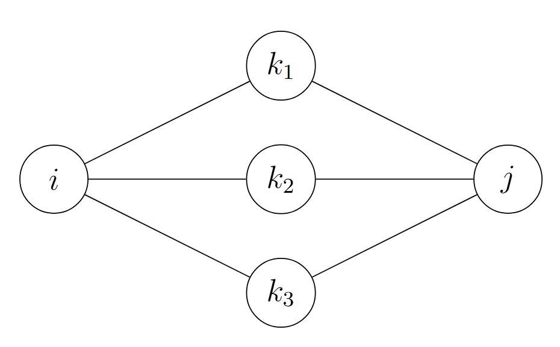
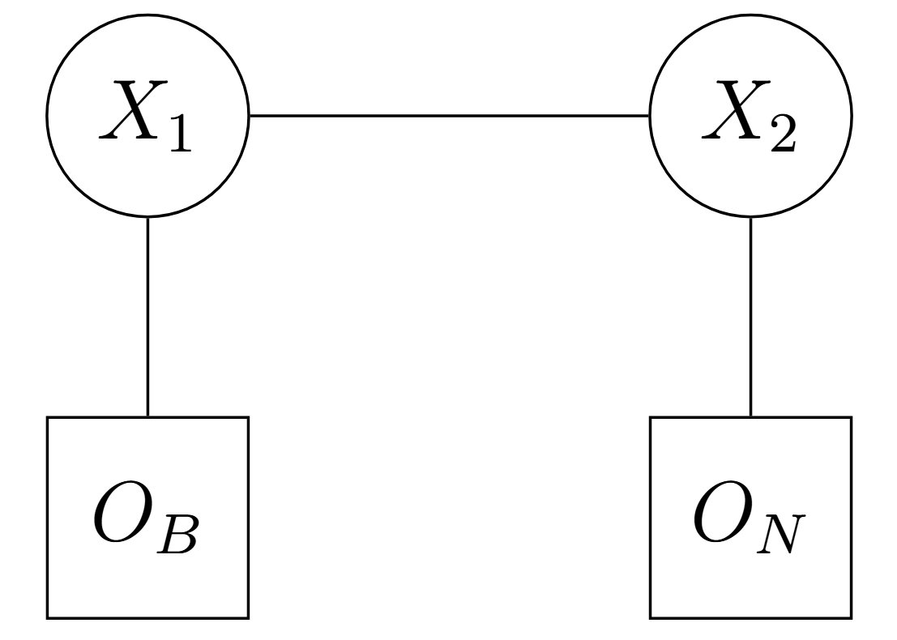

# Espacio Probabilístico y Procesos Estocásticos Subyacentes

Para establecer formalmente una Cadena de Markov a Tiempo Continuo (CTMC), es necesario partir de los axiomas fundamentales de la teoría de la medida, para más detalle consultar el libro de @Rudin1987.

Para esto, se asumirá que el lector tiene conocimientos previos sobre teoría de la medida como lo son las $\sigma$-álgebras, espacio muestral y medida de probabilidad, entre otros.

::: {.callout-note title="Definición (Espacio de Probabilidad Filtrado)"}
Sea $(\Omega, \mathcal{F}, \mathbb{P})$ un espacio de probabilidad, donde $\Omega$ es el espacio muestral, $\mathcal{F}$ es una $\sigma$-álgebra sobre $\Omega$, y $\mathbb{P}$ es una medida de probabilidad. Sea $\mathbb{F} = \{\mathcal{F}_t\}_{t \ge 0}$ una filtración, es decir, una familia no decreciente de sub-$\sigma$-álgebras de $\mathcal{F}$ tal que $\mathcal{F}_s \subseteq \mathcal{F}_t \subseteq \mathcal{F}$ para todo $0 \le s < t$. El conjunto $(\Omega, \mathcal{F}, \mathbb{F}, \mathbb{P})$ se denomina espacio de probabilidad filtrado.
:::

::: {.callout-note title="Definición (Espacio de Estados Discreto)"}
Definimos el espacio de estados $S$ como un conjunto discreto y finito (o numerable).

La topología en $S$ es discreta y su $\sigma$-álgebra asociada es el conjunto potencia $\mathcal{P}(S)$.
:::

En el contexto de nuestro proyecto, $S$ representa el conjunto de posibles colores o intensidades de un pixel (por ejemplo, el espacio RGB donde $|S| = 256^3$, o una escala de grises finita).

::: {.callout-note title="Definición (Proceso Estocástico a Tiempo Continuo)"}
Un proceso estocástico en tiempo continuo con espacio de estados discreto $S$ es una familia de variables aleatorias

$$
X = \{X(t) : t \in \mathbb{R}_{\ge 0}\},
$$

donde cada $X(t): \Omega \to S$ es una función medible respecto a $\mathcal{F}_t$.
:::

Interpretamos $X(t)$ como el "color verdadero" del pixel en el instante (o parámetro continuo) $t$.

# Cadenas de Markov a Tiempo Continuo (CTMC)

La transición del concepto general de proceso estocástico al de proceso de Markov requiere la propiedad de amnesia (pérdida de memoria).

::: {.callout-note title="Definición (Propiedad de Markov)"}
El proceso adaptado $X = \{X(t)\}_{t \ge 0}$ es una Cadena de Markov a Tiempo Continuo si satisface la condición de Markov relativa a la filtración $\mathbb{F}$: para cualquier conjunto discreto de tiempos

$$
0 \le t_1 < t_2 < \dots < t_n < t
$$

y cualquier secuencia de estados

$$
i_1, i_2, \dots, i_n, i, j \in S,
$$

se cumple que

$$
\mathbb{P}(X(t) = j \mid X(t_1) = i_1, \dots, X(t_n) = i, X(s) = i)
=
\mathbb{P}(X(t) = j \mid X(s) = i).
$$

De manera equivalente y más elegante mediante la esperanza condicional:

$$
\mathbb{P}(X(t) = j \mid \mathcal{F}_s)
=
\mathbb{P}(X(t) = j \mid X(s))
\quad
\text{c.s. (casi seguramente)}
$$

para todo $0 \le s \le t$.
:::

::: {.callout-note title="Definición (Probabilidades de Transición y Homogeneidad)"}
Definimos la probabilidad de transición del estado $i$ al estado $j$ en el intervalo $[s,t]$ como

$$
p_{ij}(s,t)
=
\mathbb{P}(X(t)=j \mid X(s)=i).
$$

Se dice que la CTMC es **homogénea en el tiempo** si $p_{ij}(s,t)$ depende únicamente de la longitud del intervalo temporal

$$
\tau=t-s.
$$

En tal caso, denotamos la probabilidad de transición como

$$
p_{ij}(\tau)
=
\mathbb{P}(X(s+\tau)=j \mid X(s)=i).
$$

Sean estas probabilidades las entradas de una matriz estocástica

$$
P(\tau)
=
[p_{ij}(\tau)]_{i,j\in S}.
$$
:::

::: {.callout-important title="Propiedad (Ecuaciones de Chapman-Kolmogorov)"}
Para cualquier $s,t \ge 0$, la familia de matrices de transición $\{P(t)\}_{t\ge0}$ forma un semigrupo de operadores estocásticos, satisfaciendo

$$
P(t+s)=P(t)P(s)
$$

lo que equivale a

$$
p_{ij}(t+s)
=
\sum_{k\in S}
p_{ik}(t)p_{kj}(s).
$$
:::

{#fig-chapman fig-align="center" width="700"}

# Dinámica Infinitesimal y Generador de la Cadena

La evolución continua del color del pixel requiere una descripción mediante probabilidades de transición, lo cual nos lleva a la representación matricial de la derivada de $P(t)$.

::: {.callout-note title="Definición (Matriz Generadora Infinitesimal)"}
Asumiendo que $p_{ij}(t)$ es diferenciable por la derecha en $t=0$, definimos la tasa de transición $q_{ij}$ del estado $i$ al estado $j$ (donde $i \neq j$) como:

$$
q_{ij}
=
\lim_{h \to 0^+}
\frac{p_{ij}(h)}{h}
\ge 0.
$$

Y para el caso $i=j$, definimos la probabilidad de salida del estado $i$ como $v_i=-q_{ii}$, dada por

$$
q_{ii}
=
\lim_{h\to0^+}
\frac{p_{ii}(h)-1}{h}
=
-\sum_{j\neq i} q_{ij}
\le 0.
$$

La matriz

$$
Q=[q_{ij}]_{i,j\in S}
$$

se denomina matriz generadora (o matriz $Q$) de la cadena. Sus filas suman cero:

$$
\sum_{j\in S} q_{ij}=0.
$$
:::

::: {.callout-important title="Propiedad (Ecuaciones Diferenciales de Kolmogorov)"}
Bajo condiciones de regularidad (que se cumplen trivialmente si el espacio de estados del color $S$ es finito), la matriz de transición $P(t)$ es la solución única a las ecuaciones diferenciales matriciales de Kolmogorov Hacia Adelante (Forward) y Hacia Atrás (Backward) @Norris1998 :

-   **Forward:**

$$
\frac{d}{dt}P(t)=P(t)Q
$$

-   **Backward:**

$$
\frac{d}{dt}P(t)=QP(t)
$$

Cuya solución formal, bajo la condición inicial $P(0)=I$ (matriz identidad), es la matriz exponencial

$$
P(t)
=
e^{Qt}
=
\sum_{n=0}^{\infty}
\frac{(Qt)^n}{n!}.
$$
:::

# Utilidad hacia Cadenas de Márkov Ocultas (HMM)

La fundamentación teórica precedente modela la dinámica subyacente determinista de la matriz de transición y la evolución estocástica de las trayectorias del sistema. Para extender esta arquitectura a un Modelo Oculto de Márkov (HMM) en el contexto de la inferencia y análisis de píxeles en imágenes que contienen letras del alfabeto latino, se formaliza la siguiente estructura bivariada:

::: {.callout-note title="Definición (Proceso Latente e Inobservable)"}
El proceso de Markov a tiempo continuo

$$
X = \{X(t)\}_{t \ge 0}
$$

sobre el espacio de estados $S$, caracterizado por su matriz generadora infinitesimal $Q$, constituye el *proceso latente*. Las alteraciones estocásticas inducidas por $Q$ a lo largo del parámetro $t$ (representando una métrica de degradación física o divergencia espacial) rigen las transiciones hacia estados degradados, manteniéndose inaccesibles a la medición directa.
:::

La variable $X(t)$ describe el estado ideal o "verdadero" del pixel.

::: {.callout-note title="Definición (Proceso de Observación Empírica)"}
Sea

$$
(O,\mathcal{P}(O))
$$

el espacio medible de las posibles mediciones obtenidas por instrumentos.

Se postula un *proceso de observación* acoplado

$$
Y=\{Y(t)\}_{t\ge0},
$$

compuesto por variables aleatorias

$$
Y(t):\Omega\to O
$$

que representan la lectura empírica o ruidosa en el parámetro $t$.
:::

En este caso $O$ denota el conjunto finito de colores o intensidades registrables por un sensor óptico y $Y$ es la lectura ruidosa del pixel en el tiempo $t$.

::: {.callout-note title="Definición (Matriz de Emisión e Independencia Condicional)"}
La dependencia estocástica entre ambos procesos queda unívocamente determinada por la condición de independencia local.

Para cualquier instante $t\ge0$, la observación $Y(t)$ es condicionalmente independiente de toda la historia previa del sistema dado el estado concurrente $X(t)$.

Formalmente, para cualquier $y\in O$ y $x\in S$:

$$
\mathbb{P}(Y(t)=y \mid \mathcal{F}_t^X,\mathcal{F}_{t^-}^Y)
=
\mathbb{P}(Y(t)=y \mid X(t)=x)
\quad
\text{c.s.}
$$

donde $\mathcal{F}_t^X$ y $\mathcal{F}_{t^-}^Y$ denotan las filtraciones del historial latente y observable, respectivamente.

Estas probabilidades definen las entradas de la matriz de emisión estocástica

$$
E=[e_{xy}],
$$

donde

$$
e_{xy}
=
\mathbb{P}(Y(t)=y \mid X(t)=x).
$$
:::

# Inferencia y Filtrado en el Modelo Oculto

Una vez establecida la dinámica del sistema, es necesario desarrollar la maquinaria analítica para inferir el estado latente del pixel a partir de las observaciones empíricas.

Supongamos que disponemos de una secuencia de observaciones

$$
Y=(y_1,y_2,\dots,y_K)
$$

en instantes discretos de tiempo (o espacio)

$$
0 \le t_1 < t_2 < \dots < t_K \le T.
$$

::: {.callout-note title="Definición (Filtro Hacia Adelante (Forward) y Verosimilitud)"}
Definimos la variable de avance $\alpha_k(i)$ como la probabilidad conjunta de observar la secuencia parcial hasta el $k$-ésimo instante y que el estado oculto en dicho instante sea $i\in S$:

$$
\alpha_k(i)
=
\mathbb{P}
\bigl(
Y(t_1)=y_1,\dots,Y(t_k)=y_k,
X(t_k)=i
\bigr).
$$

Esta cantidad se calcula recursivamente mediante la ecuación de Chapman-Kolmogorov y la matriz de emisión:

$$
\alpha_k(j)
=
\left(
\sum_{i\in S}
\alpha_{k-1}(i)\,
p_{ij}(\Delta t_k)
\right)
\mathbb{P}
\bigl(
Y(t_k)=y_k
\mid
X(t_k)=j
\bigr)
$$

donde

$$
\Delta t_k=t_k-t_{k-1}
$$

y

$$
p_{ij}(\Delta t_k)
$$

es la entrada correspondiente de la matriz de transición

$$
P(\Delta t_k)
=
e^{Q\Delta t_k}.
$$

La verosimilitud total de la secuencia de observaciones es simplemente

$$
\mathbb{P}(Y)
=
\sum_{i\in S}
\alpha_K(i).
$$
:::

::: {.callout-note title="Definición (Decodificación Óptima Global)"}
Para reconstruir la trayectoria más probable, buscamos la secuencia de estados latentes

$$
\hat{X}
=
(\hat{x}_1,\dots,\hat{x}_K)
$$

que maximice la probabilidad condicional conjunta

$$
\hat{X}
=
\arg\max_{x_1,\dots,x_K}
\mathbb{P}
\Bigl(
X(t_1)=x_1,\dots,X(t_K)=x_K
\mid
Y(t_1)=y_1,\dots,Y(t_K)=y_K
\Bigr).
$$

La solución sistemática a este problema de programación dinámica espacial/temporal se obtiene mediante la adaptación del Algoritmo de Viterbi para cadenas a tiempo continuo, evaluando las transiciones máximas sobre

$$
P(\Delta t_k).
$$
:::

Para los pixeles es la trayectoria más probable de los colores verdaderos del pixel (el problema de decodificación).

## Ejemplo ilustrativo del algoritmo Forward--Backward

Para ilustrar el funcionamiento de los algoritmos Forward y Backward en el contexto del reconocimiento de imágenes, consideremos un píxel cuyo color verdadero puede encontrarse en uno de dos estados ocultos:

$$
S=\{B,N\},
$$

donde:

-   $B$: píxel verdaderamente blanco.
-   $N$: píxel verdaderamente negro.

Debido al ruido en el proceso de adquisición de la imagen, el color observado puede diferir del color real.

Supongamos que la dinámica del píxel está descrita por la matriz de transición

$$
P=
\begin{pmatrix}
0.8 & 0.2\\
0.3 & 0.7
\end{pmatrix},
$$

donde, por ejemplo,

$$
p_{BN}=0.2
$$

representa la probabilidad de que un píxel blanco pase al estado negro en el siguiente instante.

Asimismo, consideremos la siguiente matriz de emisión:

$$
E=
\begin{pmatrix}
0.9 & 0.1\\
0.2 & 0.8
\end{pmatrix},
$$

cuyas columnas corresponden a las observaciones

$$
(O_B,O_N),
$$

es decir, observar blanco u observar negro. Por ejemplo,

$$
P(O_B \mid B)=0.9,
\qquad
P(O_B \mid N)=0.2.
$$

Finalmente, asumimos una distribución inicial

$$
\pi=(0.6,0.4),
$$

y que la secuencia observada es

$$
Y=(O_B,O_N).
$$

Esto significa que el sensor registra blanco en el primer instante y negro en el segundo.

### Cálculo Forward

La variable Forward se define como

$$
\alpha_k(i)
=
P(y_1,\ldots,y_k,X_k=i).
$$

#### Paso 1

Para la primera observación $O_B$:

$$
\alpha_1(B)
=
P(X_1=B)\,P(O_B\mid B)
=
0.6(0.9)
=
0.54,
$$

$$
\alpha_1(N)
=
P(X_1=N)\,P(O_B\mid N)
=
0.4(0.2)
=
0.08.
$$

#### Paso 2

Calculamos primero la probabilidad de alcanzar el estado blanco:

$$
\sum_{i\in S}
\alpha_1(i)p_{iB}
=
0.54(0.8)+0.08(0.3)
=
0.456.
$$

Multiplicando por la probabilidad de emisión correspondiente,

$$
\alpha_2(B)
=
0.456(0.1)
=
0.0456.
$$

Análogamente, para el estado negro:

$$
\sum_{i\in S}
\alpha_1(i)p_{iN}
=
0.54(0.2)+0.08(0.7)
=
0.164,
$$

y por tanto,

$$
\alpha_2(N)
=
0.164(0.8)
=
0.1312.
$$

#### Verosimilitud de la secuencia observada

La probabilidad total de observar la secuencia $Y$ es

$$
P(Y)
=
\alpha_2(B)+\alpha_2(N),
$$

es decir,

$$
P(Y)
=
0.0456+0.1312
=
0.1768.
$$

### Cálculo Backward

La variable Backward se define mediante

$$
\beta_k(i)
=
P(y_{k+1},\ldots,y_T\mid X_k=i).
$$

Como la secuencia contiene únicamente dos observaciones,

$$
\beta_2(B)=\beta_2(N)=1.
$$

Retrocediendo un paso:

$$
\beta_1(B)
=
0.8(0.1)(1)
+
0.2(0.8)(1)
=
0.24,
$$

y

$$
\beta_1(N)
=
0.3(0.1)(1)
+
0.7(0.8)(1)
=
0.59.
$$

### Inferencia del estado oculto

Una de las principales ventajas del algoritmo Forward--Backward es que permite calcular la probabilidad posterior de cada estado oculto.

Para el estado blanco en el primer instante,

$$
\gamma_1(B)
=
P(X_1=B\mid Y)
=
\frac{\alpha_1(B)\beta_1(B)}
{P(Y)},
$$

por lo que

$$
\gamma_1(B)
=
\frac{0.54(0.24)}
{0.1768}
=
0.733.
$$

De forma análoga,

$$
\gamma_1(N)
=
\frac{\alpha_1(N)\beta_1(N)}
{P(Y)}
=
\frac{0.08(0.59)}
{0.1768}
=
0.267.
$$

En consecuencia,

$$
P(X_1=B\mid Y)\approx 73.3\%,
$$

mientras que

$$
P(X_1=N\mid Y)\approx 26.7\%.
$$

**Interpretación**

A pesar de que el sensor observa un píxel blanco en el primer instante y negro en el segundo, el algoritmo Forward--Backward determina que existe aproximadamente un $73\%$ de probabilidad de que el color verdadero inicial haya sido blanco. Este resultado muestra cómo un Modelo Oculto de Markov combina la información proporcionada por las observaciones ruidosas con la dinámica de transición del sistema para inferir el estado real subyacente del píxel.

{#fig-pixelbn fig-align="center" width="450"}

# Estimación de Parámetros y Calibración del Modelo

En la práctica, la matriz generadora infinitesimal $Q$ (que dicta la tasa de degradación del color para el caso de estudio) y las probabilidades de emisión empírica rara vez son conocidas a priori y deben ser estimadas a partir de un dataset de imágenes (el alfabeto latino modificado).

::: {.callout-important title="Propiedad (Algoritmo de Expectation-Maximization (Baum-Welch))"}
La estimación por máxima verosimilitud del conjunto de parámetros del modelo

$$
\Theta=\{Q,E\}
$$

dado un conjunto de secuencias observadas se realiza mediante un proceso iterativo.

-   **Paso E (Expectation):** Se calculan las estadísticas suficientes esperadas del sistema latente (tiempo esperado de permanencia en cada estado de color y número esperado de transiciones) condicionado a las observaciones y a la estimación actual de los parámetros $\Theta^{(m)}$, utilizando las variables recursivas Forward y Backward.

-   **Paso M (Maximization):** Se actualizan los parámetros $\Theta^{(m+1)}$ para maximizar la función Q de verosimilitud esperada. En particular, la estimación de las probabilidades de transición empíricas se formula restringiendo las soluciones para garantizar que las filas de $Q^{(m+1)}$ sigan sumando cero y $q_{ij}\ge0$ para $i\neq j$.
:::

{#fig-ME fig-align="center" width="800"}

